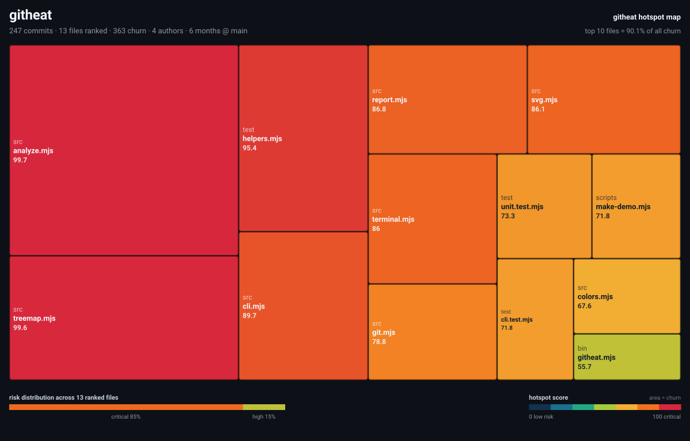

# githeat

**Find the files that are quietly costing you the most — then watch the heat move.**

`githeat` reads your git history, ranks every source file by how much editing
pressure it absorbs, prints a heat table in your terminal, and renders a
self-contained SVG heatmap you can drop straight into a README or a PR.

Zero dependencies. No config. No account. Nothing leaves your machine.



```console
$ node bin/githeat.mjs /path/to/your/repo
```

```console
chalk all time · 359 commits · 33 files · 70 authors · 390 churn
top 10 files hold 64.6% of all churn — concentrated risk

   #  score  heat           changes     churn  auth  last  file
-----------------------------------------------------------------------------
   1   99.7  ████████████        29        29     9    5d  source/index.js
   2   93.5  ███████████░        21        21     8    5d  test/chalk.js
   3   80.0  ██████████░░        60        60    19  7.2y  index.js
   4   80.0  ██████████░░        36        36    13  9.2y  test.js
   5   80.0  ██████████░░        26        26    13  5.2y  index.d.ts
   6   79.1  █████████░░░        14        14     4   2mo  examples/rainbow.js
   7   79.1  █████████░░░        14        14     4   2mo  source/index.d.ts
   8   73.9  █████████░░░        20        20    13  5.2y  index.test-d.ts

bands: critical 9 high 12 medium 12 low 0
```

*(real output — `githeat heat chalk --top 8`)*

---

## Why hot files, not complex files

Two decades of empirical software research keep landing on the same result:
**how often a file changes predicts defects better than how complicated it is.**
Cyclomatic complexity tells you a file *could* be hard. Churn tells you a file
*is* repeatedly reopened, re-reviewed and re-broken by real people under real
deadlines. That is where your next bug is already sitting.

`githeat` turns that signal into a number and a picture, in one command.

## Install

Not on npm yet — clone it or run it straight from the repository:

```bash
git clone https://github.com/xiaozhenweiyan/githeat
cd githeat
node bin/githeat.mjs heat /path/to/your/repo
```

`npm i -g` arrives with the first npm release; the `bin` entry is already wired.
Requires Node 18+ and `git` on your PATH — that is the whole dependency list.

## Use

```bash
githeat                                    # rank the current repo
githeat --since 3.months --top 25          # just this quarter
githeat --format tree                      # which directories own the churn
githeat --format svg --out docs/heat.svg   # save a map for the README
githeat --format html --open               # full interactive report
githeat --json | jq '.hotspots[0]'         # feed a script or a dashboard
githeat check --max-score 90               # CI gate, exit code 1 on breach
githeat install-hook                       # non-blocking pre-commit reminder
```

| flag | what it does |
| --- | --- |
| `--since <when>` / `--until <when>` | time window (`12.months`, `2024-01-01`, `"6 weeks ago"`), UTC, both ends inclusive |
| `--author <pattern>` | only one person's commits — see where *you* keep going back |
| `--rev <range>` | `main`, `v1.0..HEAD`, any revision range |
| `--min-commits <n>` | ignore files touched fewer than n times (default 2) |
| `--ext <list>` | score only these extensions, e.g. `"js,ts,py"`; `--ext ""` scores every file |
| `--include-noise` | keep lockfiles, `dist/`, vendored and generated files |
| `--format <fmt>` | `table`, `tree`, `json`, `svg`, `html` |
| `--palette <name>` | `ember` (default), `viridis` (colour-blind safe), `mono` (print) |
| `--top <n>`, `--tiles <n>` | rows to print, tiles in the map |

## How the score works

Every ranked file gets a **hotspot score from 0 to 100**:

```
score = 100 × (0.68 × churn + 0.32 × changes) × recency
```

- **churn** — how many times the file was changed across commits. Normalised on a
  log scale anchored at the repository's own 90th percentile, so one giant
  generated file cannot flatten everything else to zero.
- **changes** — how many separate commits touched it. Being reopened 30 times in
  30 commits is worse than one sweeping rewrite.
- **recency** — a file nobody has touched in a year is 20% less urgent than one
  edited last week.

Bands: `critical ≥ 70`, `high ≥ 45`, `medium ≥ 20`, `low` below that.

**What is filtered before scoring:** lockfiles, `node_modules/`, `vendor/`,
`dist/`, build output, minified files, images, binaries — and, by default,
non-code files such as `package.json` and `readme.md`. Config and docs are
edited constantly and debugged never; scoring them buries the real signal.
Override with `--ext ""`.

**Author dates, not committer dates.** Rebases and squash merges rewrite the
committer date, which would make every file look freshly touched. Windows are
applied to author dates in UTC so a report means the same thing on every machine.

## In CI

```yaml
- run: node bin/githeat.mjs check --max-score 90 --max-critical 0
```

`check` prints a short verdict and exits `1` when a threshold breaks, `0`
otherwise, `2` on a usage error. `--quiet` reduces it to a single line for logs.

The pre-commit hook installed by `githeat install-hook` uses a deliberately loose
threshold: it reminds, it never blocks a commit for you.

## As a library

```js
import { readHistory, analyze, renderSvg } from 'githeat';
import { writeFileSync } from 'node:fs';

const report = analyze(readHistory({ cwd: '.', since: '6.months' }));
writeFileSync('heat.svg', renderSvg(report, { title: 'my-service' }));
console.log(report.files[0]); // { path, score, commits, churn, authors, last, ... }
```

Nothing in the library touches the network or writes to your repo unless you ask.

## Performance

One `git log` call, one parse, one layout — no per-file subprocess, no index to
keep warm. On a warm cache a run costs ~0.7 s wall time, of which ~0.18 s is Node
start-up and ~0.26 s is git itself for a 359-commit repository; the JavaScript
analysis is the cheap part. Full method and raw numbers:
[`docs/benchmark.md`](docs/benchmark.md).

For very large monorepos, scope the window: `githeat --since 12.months`.

## How it compares

- `git log --stat` / `git-quick-stats` — great at *describing* history, no ranking,
  no map, no threshold to gate on.
- CodeScene and friends — the same idea, commercial, hosted, needs an account.
- `githeat` — one command, local, no dependencies, produces an image and an exit
  code you can put in CI.

## Development

```bash
npm test          # 38 tests, including a real throwaway repository
npm run demo      # regenerate docs/ (synthetic history, stable image)
```

See [CONTRIBUTING.md](CONTRIBUTING.md), [CHANGELOG.md](CHANGELOG.md) and the
[benchmark notes](docs/benchmark.md).

MIT licensed. Issues and pull requests welcome — especially "this ranked my
`foo.bar` at 99 and it does not deserve it" reports, which are the most useful
bug reports this kind of tool can get.

---

**中文说明** → [README.zh-CN.md](README.zh-CN.md)
